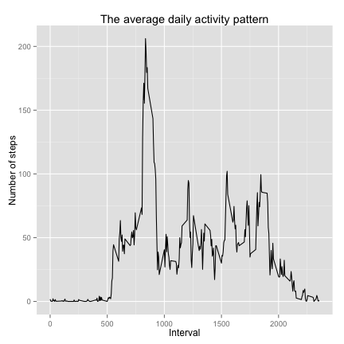
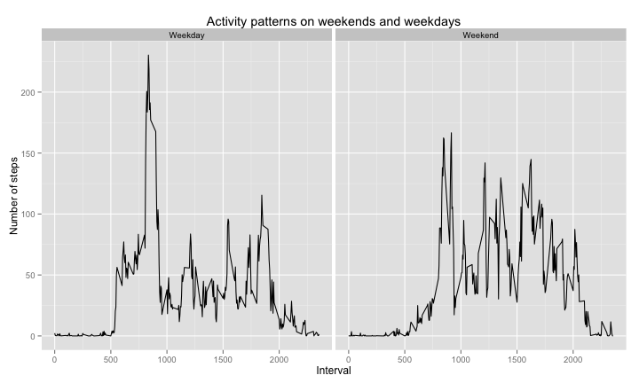

# Reproducible Research: Peer Assessment 1


```r
opts_chunk$set(message = FALSE, fig.width = 6, fig.height = 6)
```


```r
require(plyr)
require(ggplot2)
```


## Loading and preprocessing the data


```r
unzip("activity.zip")
activity <- read.csv("activity.csv", header = TRUE)
activity <- transform(activity, date = as.Date(date))
```


## What is mean total number of steps taken per day?


```r
stepsPerDay <- ddply(activity, ~date, summarise, steps = sum(steps))
```


```r
p <- ggplot(stepsPerDay, aes(steps))
p <- p + geom_histogram(fill = "white", color = "black")
p <- p + ggtitle("Total number of steps per day")
p + xlab("steps per day")
```

 


```r
meanStepsPerDay <- mean(stepsPerDay$steps, na.rm = TRUE)
medianStepsPerDay <- median(stepsPerDay$steps, na.rm = TRUE)
```


- The mean of total number steps per day is 10766
- The median of total number steps per day is 10765

## What is the average daily activity pattern?


```r
stepsPerInterval <- ddply(activity, ~interval, summarise, avg.steps = mean(steps, 
    na.rm = T))
```


```r
p <- ggplot(stepsPerInterval, aes(interval, avg.steps)) + geom_line()
p <- p + ggtitle("The average daily activity pattern")
p <- p + xlab("5-minute interval over day")
p + ylab("Average number of steps")
```

 


```r
maxId <- which.max(stepsPerInterval$avg.steps)
maxInterval <- stepsPerInterval$interval[maxId]
```


## Imputing missing values


```r
numberRowNAs <- sum(apply(is.na(activity), 1, any))
```


- The total number of missing values in the dataset is 2304


```r
na.replace <- function(act) {
    ddply(act, ~interval, function(dd) {
        steps <- dd$steps
        dd$steps[is.na(steps)] <- mean(steps, na.rm = TRUE)
        return(dd)
    })
}
```


```r
imputedActivity <- na.replace(activity)
```


```r
imputedStepsPerDay <- ddply(imputedActivity, ~date, summarise, steps = sum(steps))
```


```r
p <- ggplot(imputedStepsPerDay, aes(steps))
p <- p + geom_histogram(fill = "white", color = "black")
p <- p + ggtitle("Total number of steps per day")
p + xlab("steps per day")
```

 


```r
imputedMeanStepsPerDay <- mean(imputedStepsPerDay$steps)
imputedMedianStepsPerDay <- median(imputedStepsPerDay$steps)
```


- The mean of total number steps per day is 
10766
- The median of total number steps per day is 
10766

## Are there differences in activity patterns between weekdays and weekends?


```r
weekParts <- c("Weekday", "Weekend")
date2weekpart <- function(date) {
    day <- weekdays(date)
    part <- factor("Weekday", weekParts)
    if (day %in% c("Saturday", "Sunday")) 
        part <- factor("Weekend", weekParts)
    return(part)
}

imputedActivity$weekpart <- sapply(imputedActivity$date, date2weekpart)
```


```r
avgSteps <- ddply(imputedActivity, .(interval, weekpart), summarise, mean = mean(steps))

p <- ggplot(avgSteps, aes(x = interval, y = mean))
p <- p + geom_line() + facet_grid(. ~ weekpart, )
p <- p + ggtitle("Activity patterns on weekends and weekdays")
p + xlab("5-minute interval over day") + ylab("Average number of steps")
```

 

